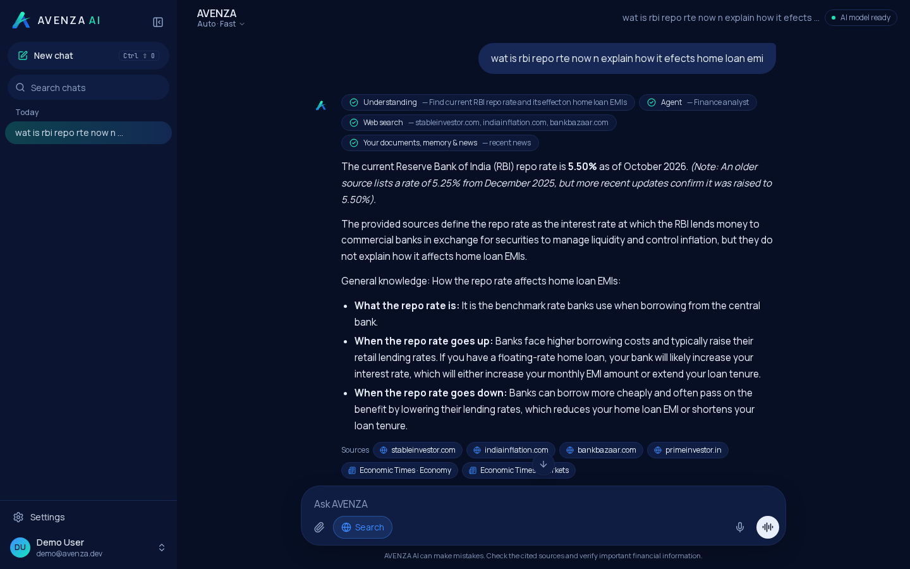
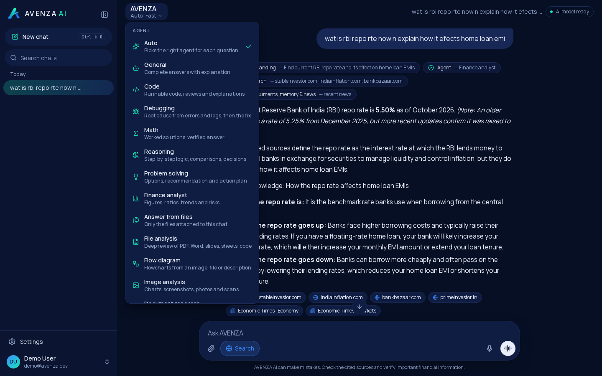
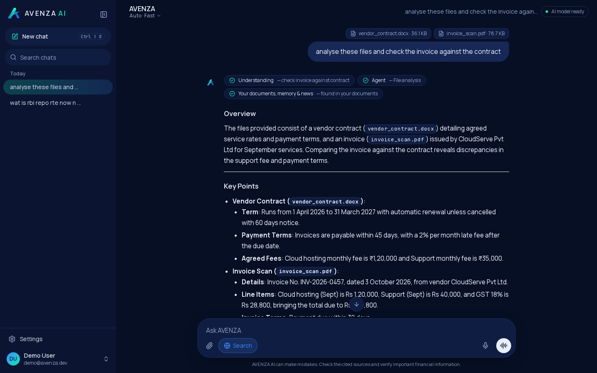
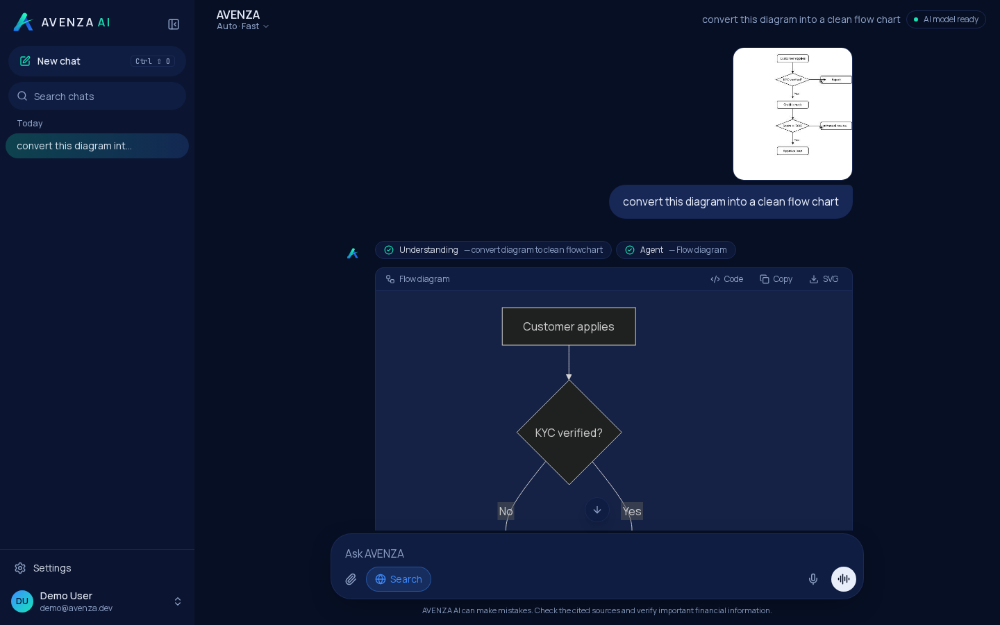
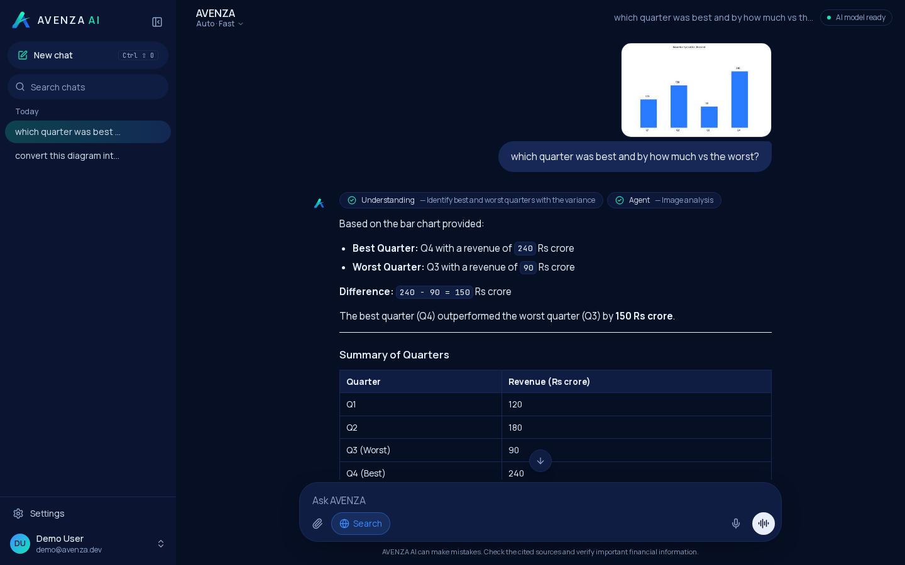
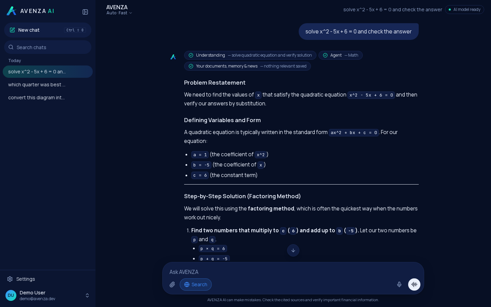
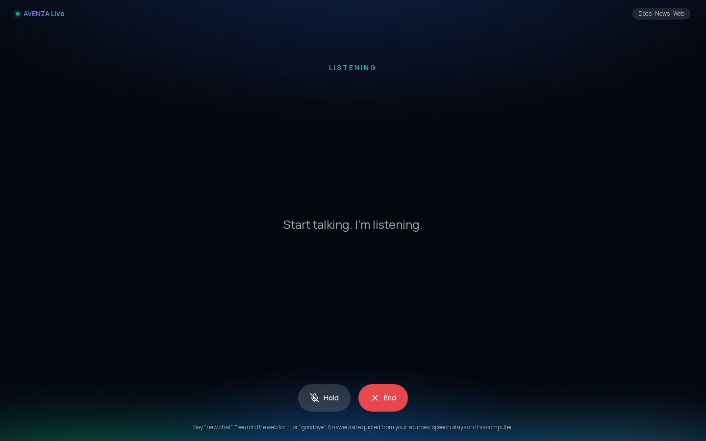
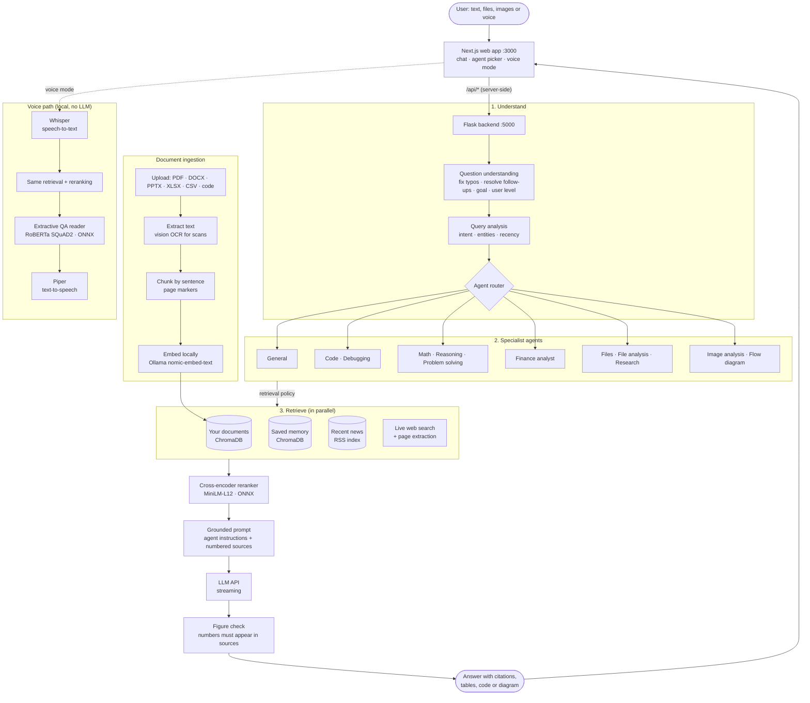

# AVENZA AI

**A multi-agent, source-grounded AI assistant for finance and technology work.**
Ask questions, analyse files, read charts and screenshots, draw flow diagrams, or just talk to it.
Every answer is built from real sources (your documents, saved memory, recent news and live web search) and cites them.



| Agents | File analysis | Flow diagrams |
| --- | --- | --- |
|  |  |  |
| **Image analysis** | **Math** | **Voice mode** |
|  |  |  |

---

## Contents

- [Quick start](#quick-start)
- [Features](#features)
- [Architecture: Multi-Agent RAG](#architecture-multi-agent-rag)
- [Agents](#agents)
- [How answers stay accurate](#how-answers-stay-accurate)
- [Using AVENZA](#using-avenza)
- [Configuration](#configuration)
- [Manual setup](#manual-setup)
- [Troubleshooting](#troubleshooting)
- [Project structure](#project-structure)
- [Backend API](#backend-api)
- [Privacy](#privacy)

---

## Quick start

**You need:** Linux or macOS (Windows: use WSL), [Node.js 20+](https://nodejs.org), [Python 3.11+](https://www.python.org), [Ollama](https://ollama.com) and an API key for an OpenAI-compatible LLM API.

```bash
git clone https://github.com/Shriniketh59/avenza-ai.git
cd avenza-ai
./start.sh
```

Open **http://localhost:3000**, create an account, and start asking.

`start.sh` does everything and is safe to run every time; each step is skipped once done:

1. checks Node, Python and Ollama,
2. creates `.env.local`, generates `AUTH_SECRET` and asks for your `LLM_API_KEY`,
3. creates the Python virtualenv and installs the backend packages,
4. installs the npm packages,
5. starts Ollama if needed, pulls the `nomic-embed-text` embedding model and downloads a speech voice,
6. starts the web app (port 3000) and the backend (port 5000, local only) together.

The first run takes a few minutes (≈1 GB of packages). The reranker, question-answering and speech-to-text models (~300 MB) download automatically the first time the backend starts. Press **Ctrl+C** to stop everything.

| Command | What it does |
| --- | --- |
| `./start.sh` | set up what is missing, then run the app |
| `./start.sh --setup-only` or `npm run setup` | set up only |
| `npm run dev` | run the app (after setup) |
| `npm run lint && npx tsc --noEmit` | check the frontend |

---

## Features

- **Grounded chat**: every answer comes from retrieved sources and cites them as `[1]`, `[2]`; figures that appear in no source are flagged under the answer.
- **12 specialist agents** with automatic routing: General, Code, Debugging, Math, Reasoning, Problem solving, Finance analyst, Document research, Answer from files, File analysis, Flow diagram and Image analysis.
- **Human-like question understanding**: typos, shorthand ("wat is rbi repo rte") and follow-ups ("n wat abt tcs") are rewritten into a clear question before searching, and the answer is pitched to your level.
- **Files**: PDF (including scanned PDFs, read with vision OCR), Word, PowerPoint (with speaker notes and chart data), Excel, CSV/TSV, HTML, JSON, code and text. Answers cite the page or slide.
- **Images**: charts, screenshots, receipts and photos; text and numbers are read exactly.
- **Flow diagrams**: rendered in the chat from a sketch, a document or a description; copy the code or download an SVG.
- **Live data**: web search, a recent-news index (refreshed every 30 minutes) and your own documents, searched in parallel.
- **Memory**: tell it "my name is …" or "I work at …" and it remembers (can be turned off).
- **Voice mode**: hands-free conversation with local speech-to-text and text-to-speech; spoken answers are quoted from sources by local models (no LLM).

---

## Architecture: Multi-Agent RAG



**How a message flows**

1. **Understand**: a fast LLM call (~1 s) rewrites the message as a clear question, writes a search query, notes the goal and the user's level, and suggests an agent. If it is slow or fails, rule-based analysis takes over.
2. **Route**: the agent router picks a specialist (or uses the one you chose). Each agent has its own instructions, model size, reasoning depth, retrieval policy and source rules.
3. **Retrieve**: documents and memory (vector search), recent news and live web search run in parallel. Attached files are read directly (whole small files, the most relevant parts of large ones).
4. **Rerank**: a local cross-encoder scores every passage against the question and drops off-topic ones.
5. **Generate**: the LLM writes the answer from the numbered sources only, streamed to the browser.
6. **Check**: any figure in the answer that is in none of the sources is flagged; calculations must show their working.

---

## Agents

Pick an agent from the menu under the **AVENZA** title, or leave it on **Auto**.

| Agent | Use it for | What you get |
| --- | --- | --- |
| **Auto** | anything | the best agent for each question |
| **General** | facts, explanations | direct answer, then explanation and context |
| **Code** | writing or reviewing code | complete runnable code, how to run it, edge cases |
| **Debugging** | errors, stack traces, "not working" | root cause first, ranked alternatives, the fix, how to verify |
| **Math** | equations, calculus, statistics | every step shown, result verified, final **Answer** |
| **Reasoning** | comparisons, decisions with numbers | given facts, worked steps, a check, final answer |
| **Problem solving** | "how do I …", plans, strategy | options with pros and cons, a recommendation, an action plan |
| **Finance analyst** | companies, markets, ratios | key figure first, drivers, trends, risks, tables |
| **Answer from files** | questions about attached files | answers quoted and cited from those files only |
| **File analysis** | "analyse / review / summarise this" | overview, key points, figures table, insights, issues, actions |
| **Flow diagram** | flowcharts and process maps | a rendered diagram plus a walkthrough |
| **Image analysis** | charts, screenshots, photos | exact readings of text and numbers, then the answer |
| **Document research** | all your saved documents | quoted, cited answers across documents |

Agents are defined in [`backend/avenza/ai/agents.py`](backend/avenza/ai/agents.py). Each is a set of instructions, a model size, a reasoning depth and retrieval rules on top of the shared pipeline, so adding one takes a few lines.

---

## How answers stay accurate

The LLM is used to **write** answers quickly; **facts come from sources**.

- The prompt allows facts, figures, names and dates only if they appear in the numbered sources (or are stable textbook knowledge), each with its citation.
- If the sources do not answer the question, the assistant says so instead of guessing.
- A post-check flags any number in the answer that is not in the sources. Calculations must be shown, like `40,000 - 35,000 = 5,000`.
- Web pages are cleaned before use: sentence splitting that understands abbreviations (`a.m.`, `U.S.`, `Inc.`), tables turned into labelled lines, encoding fixed, page dates and headings removed.
- Voice answers use no LLM at all: a local extractive model quotes the exact answer span and names its source.

---

## Using AVENZA

- **Attach files** with the paperclip (up to 5 at once, 20 MB each). Ask "analyse this", "check the invoice against the contract", or any question about them.
- **Attach images** the same way. Ask about a chart, a screenshot of an error, or say "convert this diagram into a flow chart".
- **Web search** toggle (globe button) turns live search on or off.
- **Fast / Accurate** (in the agent menu) picks the smaller or larger model. Code, Debugging, Math, Reasoning and image agents always use the larger one.
- **Voice mode**: press the wave button when the message box is empty. Say "new chat", "search the web for …", "turn off web search" or "goodbye". Tap anywhere to interrupt. The microphone works on `http://localhost:3000` or HTTPS only (browser rule).
- **Memory**: say "remember that …" or "my name is …". Turn it off in Settings.

---

## Configuration

All settings live in `.env.local` (created by `start.sh` from [`.env.example`](.env.example)).

| Variable | Required | Purpose |
| --- | --- | --- |
| `LLM_API_KEY` | yes, for chat | API key for the LLM (OpenAI-compatible chat completions API) |
| `LLM_PROVIDER` | no | provider preset from `backend/avenza/config.py` |
| `AUTH_SECRET` | yes | 32+ random characters; generated by `start.sh` |
| `FLASK_API_URL` | yes | backend address, default `http://127.0.0.1:5000` |
| `APP_URL` | production | public URL of the app |
| `GOOGLE_CLIENT_ID` / `GOOGLE_CLIENT_SECRET` | no | Google sign-in |

Optional tuning (defaults in [`backend/avenza/config.py`](backend/avenza/config.py)):

| Variable | Default | Purpose |
| --- | --- | --- |
| `UNDERSTAND_ENABLED` | `1` | question-understanding step before search |
| `WEB_SEARCH_RESULTS` | `5` | web results per question |
| `MAX_CONTEXT_PASSAGES` | `8` | passages given to the model |
| `NEWS_ENABLED` / `NEWS_REFRESH_MINUTES` | `1` / `30` | background news index |
| `EMBED_MODEL` | `nomic-embed-text` | Ollama embedding model (changing it means re-uploading documents) |
| `WHISPER_MODEL` | `base` | speech-to-text size: `tiny`, `base`, `small` |
| `DEFAULT_VOICE` | `en_US-lessac-medium` | Piper voice |

---

## Manual setup

If you prefer to run the steps yourself:

```bash
# 1. configuration
cp .env.example .env.local          # then set LLM_API_KEY and AUTH_SECRET (openssl rand -base64 48)

# 2. backend
python3 -m venv backend/.venv
backend/.venv/bin/pip install -r backend/requirements.txt
backend/.venv/bin/python -m piper.download_voices en_US-lessac-medium --data-dir backend/instance/voices

# 3. embeddings
ollama serve &                      # skip if Ollama already runs as a service
ollama pull nomic-embed-text

# 4. frontend + start both servers
npm ci
npm run dev                         # http://localhost:3000
```

---

## Troubleshooting

| Problem | Fix |
| --- | --- |
| "The LLM API is not configured" | add `LLM_API_KEY` to `.env.local`, then restart |
| "rejected the API key" | the key is wrong or expired; replace it in `.env.local` |
| "limit reached" / "overloaded" | the LLM provider is rate-limiting; wait a minute |
| Backend shows offline | the backend is still starting (first start downloads models) or port 5000 is taken |
| "Cannot reach Ollama for embeddings" | run `ollama serve`, then `ollama pull nomic-embed-text` |
| `port 3000 is already in use` | another copy is running; stop it (Ctrl+C) and run `./start.sh` again |
| `No space left on device` during install | free ~2 GB on the disk that holds the project |
| Microphone does not work | open the app at `http://localhost:3000` (not a LAN IP) and allow the microphone |
| Voice replies are silent | run the `piper.download_voices` command from [Manual setup](#manual-setup) |
| Web search finds nothing | the search engine is rate-limiting; try again shortly |

---

## Project structure

```
avenza-ai/
├── start.sh                    one-command setup and start
├── src/                        Next.js 16 app (TypeScript, Tailwind CSS 4)
│   ├── app/                    pages and /api route handlers (proxy to Flask)
│   ├── components/             chat, agent picker, composer, voice mode, diagrams
│   ├── hooks/                  conversation store, preferences, recorder, speech player
│   └── lib/                    API client, auth (encrypted session cookie), images
└── backend/                    Flask API (Python)
    ├── run.py                  entry point (127.0.0.1:5000)
    └── avenza/
        ├── chat.py             the chat pipeline (understand, route, retrieve, generate, check)
        ├── documents.py        upload, extraction, background indexing
        ├── voice.py            speech endpoints
        └── ai/
            ├── agents.py       specialist agents and routing rules
            ├── understand.py   question understanding
            ├── rag.py          retrieval, file reading, grounded prompt
            ├── reader.py       ONNX reranker + extractive QA
            ├── websearch.py    web search and page cleaning
            ├── extract.py      PDF/DOCX/PPTX/XLSX/... extraction and OCR
            ├── nlp.py          sentence splitting, chunking, query analysis
            ├── factcheck.py    figure check
            ├── llm.py          LLM API client and local embeddings
            └── voice_answer.py LLM-free spoken answers
```

---

## Backend API

The browser only talks to Next.js (`/api/*`); Next.js calls Flask server-to-server with a bearer token.

| Endpoint | Purpose |
| --- | --- |
| `POST /auth/register`, `POST /auth/login`, `POST /auth/oauth/google` | accounts; return `{user, token}` |
| `POST /chat` | `{messages, agentId, mode, webSearch, memory, files, images}` → NDJSON stream of `tool`, `sources`, `token`, `done`, `error` events |
| `GET/POST /documents`, `GET/DELETE /documents/<id>` | upload, indexing progress, delete |
| `POST /voice/transcribe`, `POST /voice/speak`, `GET /voice/voices` | speech-to-text, text-to-speech |
| `GET /health` | status of the LLM key, Ollama and the news index |

Errors are non-2xx responses with `{"error": "message"}`.

---

## Privacy

- Runs on your machine: the web app, backend, database, document index, embeddings, reranker, speech-to-text and text-to-speech.
- Sent to the LLM API: your question and the source passages used to answer it (and attached images). Voice mode sends nothing to the LLM.
- Sent to the search engine: the search query, when web search is on.
- `.env.local`, the database and your documents (`backend/instance/`) are git-ignored and never committed.
